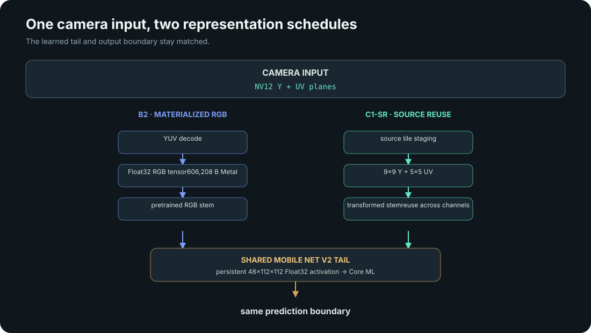
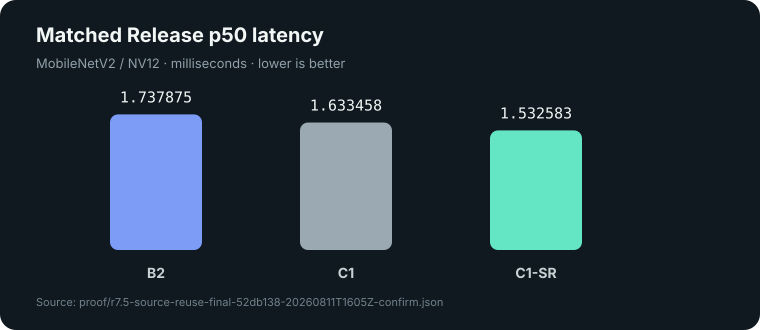
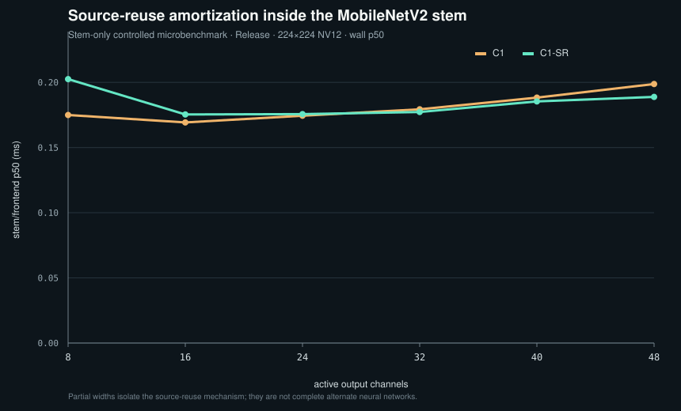
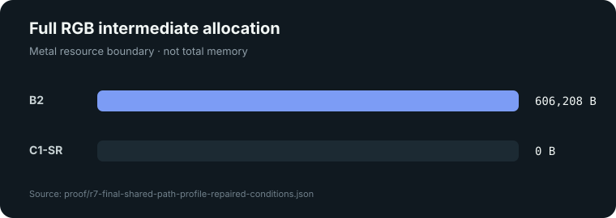

# Results and evidence

This page summarizes the committed R7.5 confirmation, target evaluation,
profiler, quality, corpus, scaling, and review artifacts. Values are tied to
their source records; a fresh run never replaces the frozen result.

## What changed?

The conventional matched path materializes normalized RGB before the learned
stem. PlaneFuse C1-SR reads the same NV12 input through a source-reuse
transformed stem, then hands the same activation shape to the unchanged
MobileNetV2 tail.



## What improved?

C1-SR is 11.8128% lower than B2 by marginal p50 while retaining the same pretrained tail and passing the declared quality checks.

## Reviewed result

| Path | Matched Release p50 |
| --- | ---: |
| B2 | 1.737875 ms |
| C1 | 1.633458 ms |
| C1-SR | 1.532583 ms |

C1-SR is 11.8128% lower than B2 and 6.1755% lower than C1 by marginal p50. The paired B2 minus C1-SR median 95% confidence interval is `[0.180250, 0.198792] ms`. These are different estimands.



## Protocol

- Five independent Release processes.
- 20 warmup triples and 240 measured triples per process.
- All 6 path-order permutations, repeated 40 times per process.
- Fixed 64-input corpus with 32 real and 32 deterministic procedural inputs.
- Explicit Core ML `.all` policy.
- Persistent Float32 activation bridge and matched input-to-result boundary.
- Deterministic 10,000-replicate block bootstrap.
- Independent technical review: **SHIP**, with no findings.

## Quality

Against C1, the source-reuse confirmation reports top-1 agreement 1.0, top-5 set agreement 1.0, top-5 rank agreement 1.0, and activation maximum error `5.960464e-6`. The separate matched B2/C1 quality artifact retains two real-image top-5 disagreements: top-5 set agreement `0.984375` and top-5 rank agreement `0.96875`.

## Source-reuse scaling

The stem-only scaling characterization varies active output-channel width over
`8, 16, 24, 32, 40, 48`, the grouping used by the C1-SR kernel. It keeps the
same transformed weights, 224×224 NV12 source geometry, Release build, and
deterministic corpus subset. It omits the unchanged Core ML tail because the
experiment isolates source staging and channel reuse. C1-SR is slower at the
narrow widths, reaches parity around 32 channels, and wins at 40 and 48; that
pattern supports reuse amortization without supporting a broad model-scaling
claim.



See the [aggregate scaling record](../proof/final/source-reuse-scaling.json),
the [raw batches](../proof/final/source-reuse-scaling-batches/), and the
[scaling implementation](../Sources/PlaneFuseCore/SourceReuseScalingBenchmark.swift).

## How to reproduce

Quick verification:

```bash
git clone https://github.com/Barap1/PlaneFuse.git
cd PlaneFuse

./pf doctor
./pf setup mobilenetv2
./pf reproduce quick
./pf evidence --check
```

The complete five-batch protocol writes fresh output under
`artifacts/reproduction/<timestamp>/`:

```bash
./pf reproduce final
```

Neither command overwrites the reviewed files in `proof/`. Exact timing can
vary with hardware, thermal state, and toolchain, so a successful reproduction
means that the paths compile, parity passes, the corpus and model lineage are
verified, and a new matched comparison can be collected.

## Representation boundary



B2 records 602,112 logical RGB payload bytes and 606,208 Metal-allocated bytes. C1-SR records 0 bytes for a full RGB intermediate. This is a resource boundary, not a total-memory claim. Both paths use the same activation handoff and perform 0 bytes of element-by-element CPU activation population.

## Negative results and context

Float16 failed the quality gate. Metal 4 was not a stable release path for this model format. The polyphase compiler produced no stable end-to-end win. Direct camera-space fusion was slower because it removed useful reuse. Pipeline A is contextual under a distinct pre-rendered image-input boundary. T2 and T3 were not met or established, and T4 was not invoked.

No power, bandwidth, universal-model, or Apple-wide speed claim is made.

## Authoritative files

- [R7.5 confirmation](../proof/r7.5-source-reuse-final-52db138-20260811T1605Z-confirm.json)
- [R7.5 target evaluation](../proof/r7.5-competition-targets.json)
- [Quality conditions](../proof/r7-b2-c1-shared-quality-conditions.json)
- [Profiler summary](../proof/r7-final-shared-path-profile-repaired-conditions.json)
- [Validation corpus](../proof/m5-validation-corpus.json)
- [A/B/C selection matrix](../proof/r7-final-selection-matrix.json)
- [Independent technical review](../proof/r7.5-independent-review.md)
- [Reproducibility record](../proof/final/reproducibility.json)
- [Public-clone reproduction](../proof/final/public-clone-reproduction.json)
- [Source-reuse scaling](../proof/final/source-reuse-scaling.json)
- [Integration example](../Examples/PlaneFuseIntegration/README.md)
- [Proof artifact map](PROOF_ARTIFACTS.md)

Regenerate with `./pf evidence` or `python3 scripts/generate_results.py --write`.
